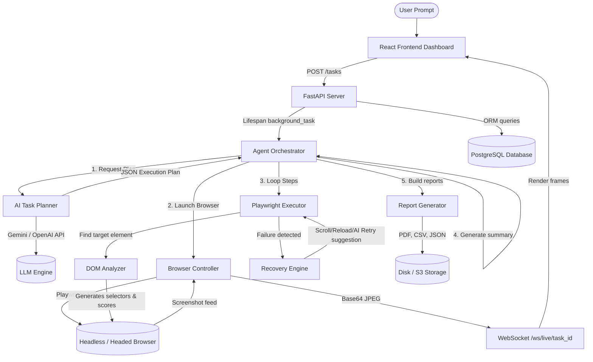

# WebPilot AI – Architecture Documentation

This document describes the modular architectural design, execution lifecycle, database relationships, and component interactions of **WebPilot AI**.

---

## 🗺️ Architectural Diagram

---

## 🔄 End-to-End Task Execution Flow

1.  **Submission**: The user enters a task (e.g. *"Compare flight tickets from Bangalore to Hyderabad for tomorrow"*). The React app calls `POST /tasks`.
2.  **Scaffolding**: The backend saves a `Task` record as `PENDING`, starts an async background task (`_run_agent_task`), and returns task metadata.
3.  **WebSocket Handshake**: The frontend connects to `ws://localhost:8000/tasks/ws/{task_id}` for progress events and `ws://localhost:8000/browser/ws/live/{task_id}` for screenshot frame streaming.
4.  **AI Planning**: The `TaskPlanner` sends the user request to Google Gemini with a system prompt instructions template. The AI responds with a structured JSON containing a list of `AgentStep` actions (e.g. `navigate`, `search`, `click`, `extract`).
5.  **Execution Loop**:
    *   The `BrowserController` starts Chromium or Firefox via Playwright.
    *   For each step, `PlaywrightExecutor` calls the `DOMAnalyzer` to locate target elements dynamically without static class names or IDs.
    *   Actions are executed with human-like delays (randomized type intervals, hover-before-click).
    *   Screenshots are captured at key moments and logged to the UI.
6.  **Self-Healing**: If an element click or type times out, the `RecoveryEngine` executes recovery strategies:
    *   *Strategy 1*: Wait 2 seconds and retry.
    *   *Strategy 2*: Smooth scroll down 300px and retry.
    *   *Strategy 3*: Reload page, wait for load, and retry.
    *   *Strategy 4*: Consult AI with context + error to suggest a new locator query.
    *   *Strategy 5*: Skip step (if optional) or fail.
7.  **Finalization**: When all steps finish, the orchestrator requests Gemini to summarize extracted text and data. The `ReportGenerator` writes PDF reports with formatted styles, CSV rows, and JSON files to `/app/reports`. Task state is marked `COMPLETED` in PostgreSQL, closing browser pages and WebSockets.

---

## 🗄️ Database Schema Design

The application uses PostgreSQL with SQLAlchemy (Async) mapping. The relations are defined below:

### `User` Table
Tracks user authentication and custom preferences.
*   `id` (PK, Integer, Indexed)
*   `email` (String, Unique, Indexed)
*   `hashed_password` (String)
*   `full_name` (String, Nullable)
*   `settings` (JSON, containing custom timeouts, screenshot frequencies, retry counts, default browser engine)
*   `created_at` / `updated_at` (DateTime)

### `Task` Table
Stores natural language instruction details, metrics, and outcomes.
*   `id` (PK, Integer, Indexed)
*   `user_id` (FK to `users.id`)
*   `prompt` (Text)
*   `status` (Enum: pending, planning, running, completed, failed, cancelled)
*   `execution_plan` (JSON list of plan steps)
*   `current_step` / `total_steps` (Integer)
*   `result_summary` (Text, Nullable)
*   `recommendation` (Text, Nullable)
*   `execution_time_ms` (Float, Nullable)
*   `success_rate` (Float, Nullable)
*   `websites_visited` (JSON list of domains)
*   `error_message` (Text, Nullable)

### `BrowserSession` Table
Tracks browser details for active tasks.
*   `id` (PK, Integer)
*   `task_id` (FK to `tasks.id`)
*   `browser_type` (String)
*   `status` (Enum: idle, navigating, interacting, waiting, closed, error)
*   `current_url` (Text)
*   `current_title` (String)
*   `headless` (Boolean)

### `ExecutionLog` Table
Maintains detailed logs for steps to allow full historical replays.
*   `id` (PK, Integer)
*   `task_id` (FK to `tasks.id`)
*   `step_index` (Integer)
*   `level` (Enum: debug, info, warning, error, success)
*   `action` (String)
*   `message` (Text)
*   `url` (Text, Nullable)
*   `success` (Boolean)
*   `error_detail` (Text, Nullable)
*   `duration_ms` (Float, Nullable)

### `Report` Table
Saves references to generated file reports.
*   `id` (PK, Integer)
*   `task_id` (FK to `tasks.id`)
*   `format` (Enum: pdf, csv, json)
*   `filename` (String)
*   `file_path` (Text)
*   `file_size` (Integer)
